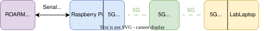
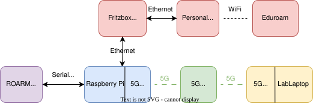
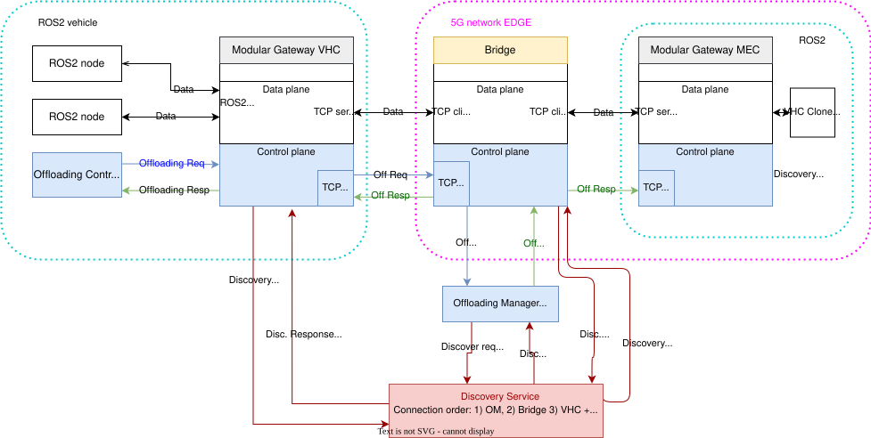
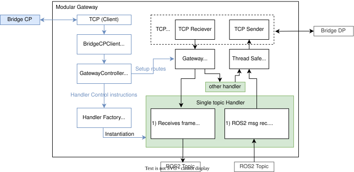
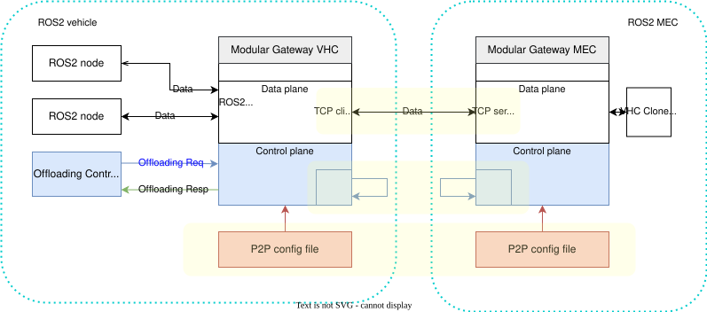
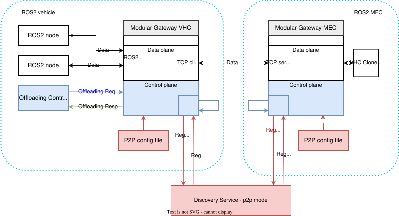
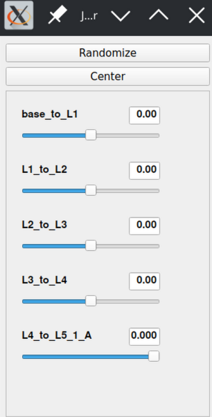
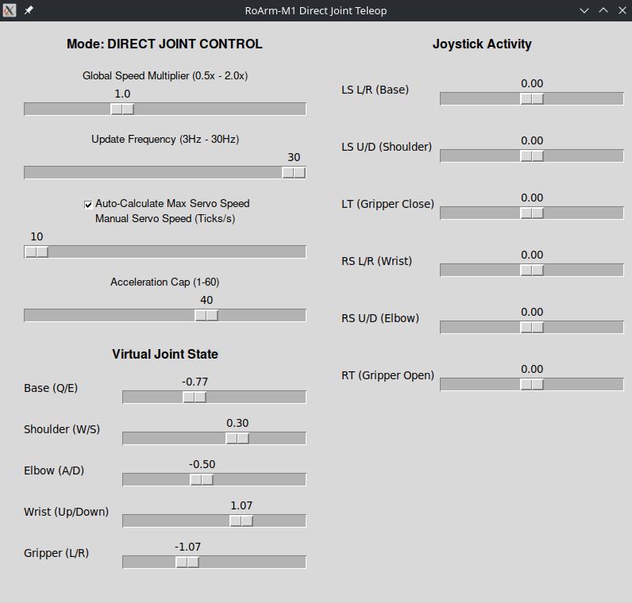
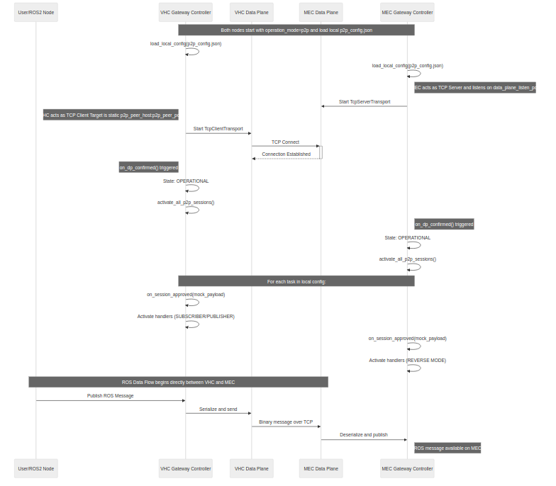
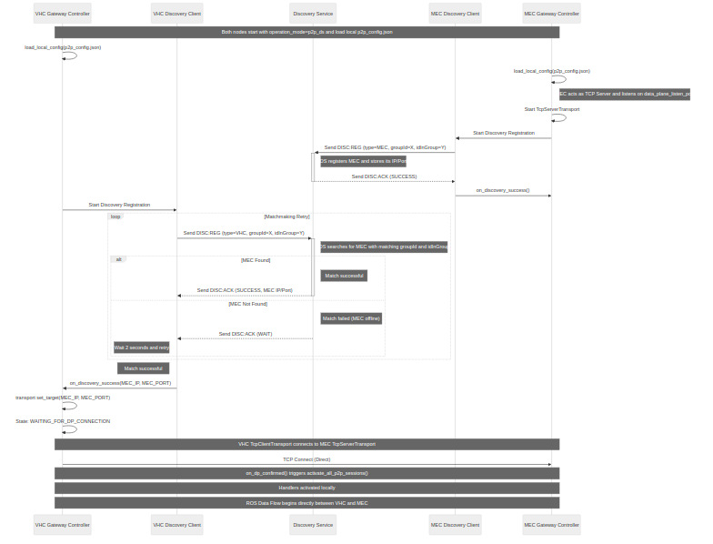

\newpage

# Introduction

The project is menat 

# Project assignment

The main goal of the project was for the author to familiarize themselve with the ROARM-M1 robotic arm, and create a solution that would allow for remote control of the robotic arm over the EURECOM 5G network. The author was expected to use the ROS2 toolchain for the robotic arm control. 

## Aproach to solving the asignment

The author was given access to a rasppbery pi 4 and a lab laptop running ubuntu 22 lts for the use in his project. The following connection sheme was created to allow for the asignment completion @fig-hw-setup .

{#fig-hw-setup}

To make the completion of the project asignmet more straightforward, it was diesected into 3 distinct parts. 
1) Connect the robotic arm to the ROS2 enviroment and allow for its control with the gamepad
1) Allow for forwarding of the control topics between two ros2 instances
1) Connect the arm-side ROS2 instance with the controler-side ROS2 instance together using the EURECOM 5G network

## Aditional devices

(#fig-hw-setup-internet)

To allow for the configuration of the rasppbery pi it had to be given internet access. Initialy use of the lab LAN network was considered, however the ports have a MAC filter on them, which made conenction of the PI complicated. As a second option the author used his personal laptop which had access to the EURECOM eduroam network. Then the author forwarded the network to the RPI. By default the ubuntu 24 LTS for rasspbery does not allow for a direct connection between a laptop and the RPI, this is something that can be configured, but without ssh access, the configuration would have to be done by adjusting system files on the boot sdcard. This is a process which is prone to errors and very hard to debug. For this reason a router was used as a DHCP server and a switch and both the RPI and the personal laptop were connected to it. Then the RPI simply used the laptop IP as the default gateway. (configuration script available in apendix XXX). This configuration shown in Image @fig-hw-setup-internet also allows for reliable SSH access to the RPI. One last issues was the time, the RPI did not sync its time through NTP when its RTC time was greatly different from real time, this could be mitigated by manualy setting aproximately correct time and then the NTP would sync the precise time. A simple script was created to automaticly get aproxiately acurate time from the internet

## ROS2 modular offloading codebase

The author of this project has worked on another project with similair use in the 6G lab at FEE CTU. The resulting codebase fully writen by the author of this project was used as a starting point for the ros2 topic forwarding in this project. This chapter will briefly describe the original codebase and its purpouse to make the final project codebase easier to understand.

The goal of the 6G lab asignment was to create a solution that could forward data from ros2 topic on one ros2 instance to another ros2 instance. The intended usecase was computation offliading from vehicles to mec servers. The solution had to be highly flexible, as one of the requirments was than a single vehicle had to be able to offload to a least 2 different MEC server at one time with every MEC server working on a different task. The MEC server were clones of the vehicle ROS2 enviroment. There are exisitng solution allowing for connection of 2 exisitng ros2 enviroments together utilising the ros2 DDS protocol. However none of the provide this level of flexibility. 

For this reason an architecture shown in @fig_om_network was designed. The main compoennts were the modular gateway, bridge and offloading manager. The offloading manager held a configurable algorithm that distributed limited resources to the vehicles, by aproving or rejecting the offliading requests. If the request was aproved, the bridge would create an internal route for the offloaded topics between the vehicle and the asigned MEC server. The data flowed in a separate connection and in all compoents there was a clear destinction between data plane and control plane parts. 

The modular gateway shown in @fig_mqw is the core part of the solution that transmits the data from ros2 topics towards the 5G network. Each topic has its own handler, this handler does ROS2 serialization and deserialization, and also allows for data manipulation for example removing unnecasry parts of the message. To achieve highest possible performance the modular gateway is multithreaded. Detailed overview of the entire offloading architecture is available in the git repository documentation

## Original network topology

{fig_om_network}

## Modular Gateway

{fig_mqw}

## P2P mode - New

## P2P with discovery

## ROARM Manufacturer ROS2 Demo

The RoARM-M1 manufacturer provides a demo software that allows for succesfull connection of the roarm-m1. The software consists of 2 parts, first part which connects to the roarm-m1 using the serial interface over usb, and translates messages it receives on the `joint_states` topic to the serial comunication protocol the ROARM uses. It also translates the radian angle rotation values in the ros2 topic to a 12 bit digital value coresponding to the rotation. 
Second part of this demo is the graphical user interface which allows for manual joint angle adjustments using sliders. This interface node then publishes the joint state messages with the current value of the sliders. 

:::: {.columns style="display: flex; justify-content: space-between;"}

::: {.column width="70%"}
* **`joint_state_publisher_gui` Node:** 
  * Basic slider to manipulate each joint
* **`/joint_states` Topic:** 
  * Intended joint coordinates (radian angle)
* **`serial_ctrl` Node**:
  * Subscribes to `/joint_states`, 
  * Radians -> hardware servo values
  * Connects to the arm over serial
:::

::: {.column width="25%"}

:::

::::

## Custom GUI

To implement the neccesary functionality a new graphical user interface node was developed. It allows for controls of the arm via either keyboard or a ros2 compatible gamepad such as the logitech F710. 
Since the 5G network introduces latency and jitter the interface decouples the conrol input from the dispatched position updtes. The node holds a virtual joint state array, which is adjusted imidiately uppon an input is received, then the virtual joint state is dispatched in the messages at a adjustable frequency of 1 to 30 Hz. There are 3 aditional adjustment sliders, the speed multplier adjust the speed at which virtual joint state will be moved by the keyboard or the controler. The max movement speed limits the arm movement speed and its value is forwarded allong with the required position on the join_state topic. Lastly the acceleartion cap limits the maximum acceleration the arms joints can reach. Limiting the acceleration is supported by the ROARM controler firmware, however the driver which comunicates with the arm hardcodes the value to 60 steps/s^2. For this reason the driver has been modified to send the acceleration maximum value received from the GUI node. The standard joint_states topic does not have a dedicated acceleration cap space, however the "effort" array was not used, so the acceleration cap values are being transmited inside the "effort" array.
To allows for control using the logitech gamepad, the ros2 joy package is used. this package connect to the gamepad and transmits the value of every axis on it to the `joy` ros2 topic. Thus the GUI only needs to subscribe to the joy topic and then use the incoming messages. The arm has 5 Degrees of freedom, however the gamepad only has 4 axis on the joysticks, for this reason the griper arm was moved to the triggers, one trigger is used to open the gripper while the other is used to close the griper. the overal direction of travel of the griper is determined by the average of both trigger effects. thus it is not a problem if both triggers are presed at the same time

:::: {.columns style="display: flex; justify-content: space-between;"}

::: {.column width="45%"}
* Replaces `joint_state_publisher_gui`
* ROS2 `joy` node for gamepad support
* Keyboard control 
* Adjustable
  * Speed
  * Joint Acceleration
  * Update frequency
:::

::: {.column width="45%"}

:::

::::

## 5G network

* 5G OAI network created by Meriem
* Severe issues connecting
  * Probably due to interference
  * Only during working hours (stable after 5:30 pm)
* RTT 40ms between laptop and RPI
* RTT 50ms to Google DNS

## Performance

* ROS2 forwarding on localhost - ROS2 to ROS2 RTT ~ 1 ms
* 5G ROS2 to ROS2 RTT ~ 40 ms with jitter
* Precise arm control achievable
* Best settings in the GUI for smoothest motion:
  * 15 Hz update frequency
  * 20 steps/s2 maximum acceleration (60 is default)

## Future steps 

* Slicing support
* DiscoveryService NAT traversal using STUN
* Further firmware and driver optimisation
  * Maximum movement execution time
  * Constant latency mode 

# Demo time

## Hardware Demonstration



## P2P mode setup

## P2P DS mode setup

