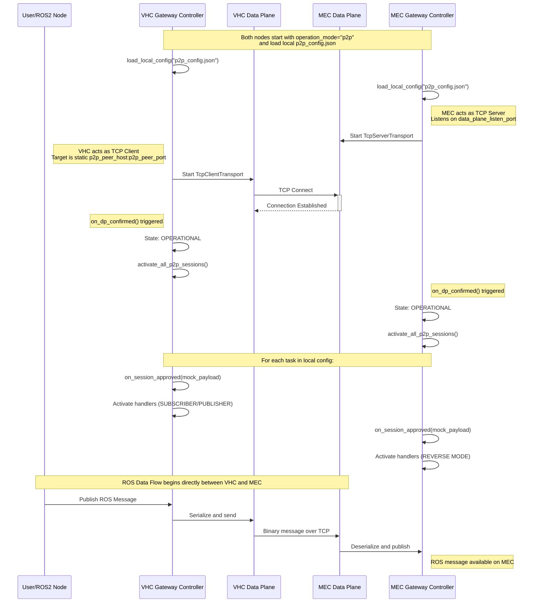
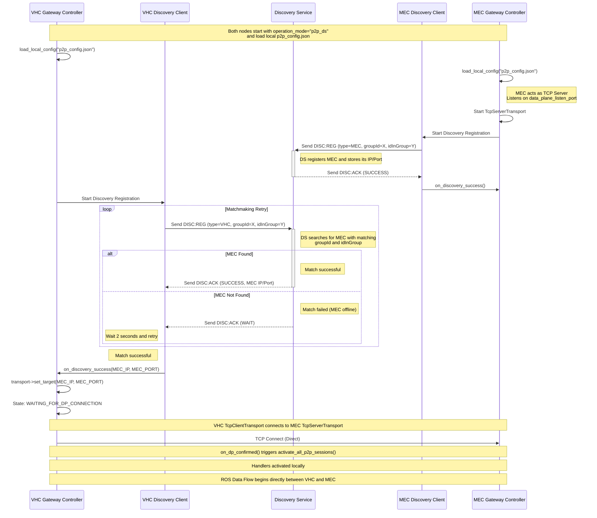

**TO RENDER THE DIAGRAMS, USE A MARKDOWN VIEWER THAT SUPPORTS MERMAID SYNTAX, SUCH AS VS CODE WITH THE "Markdown Preview Mermaid Support" EXTENSION.**

## 1. P2P Mode (Pure) Process Flow
This mode operates entirely without a Discovery Service, Bridge, or Offloading Manager. The VHC and MEC connect directly using statically configured IP addresses and ports. Session approvals are simulated locally based on a shared configuration file.

## 2. P2P_DS Mode Process Flow
This mode utilizes the Discovery Service for dynamic IP/Port matchmaking between the VHC and MEC, but still bypasses the Bridge and Offloading Manager. Sessions are still simulated locally based on a shared configuration file.

