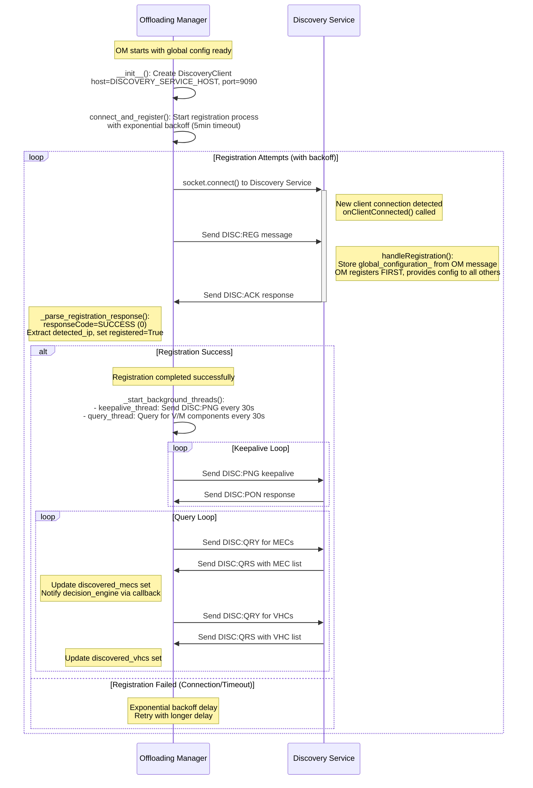
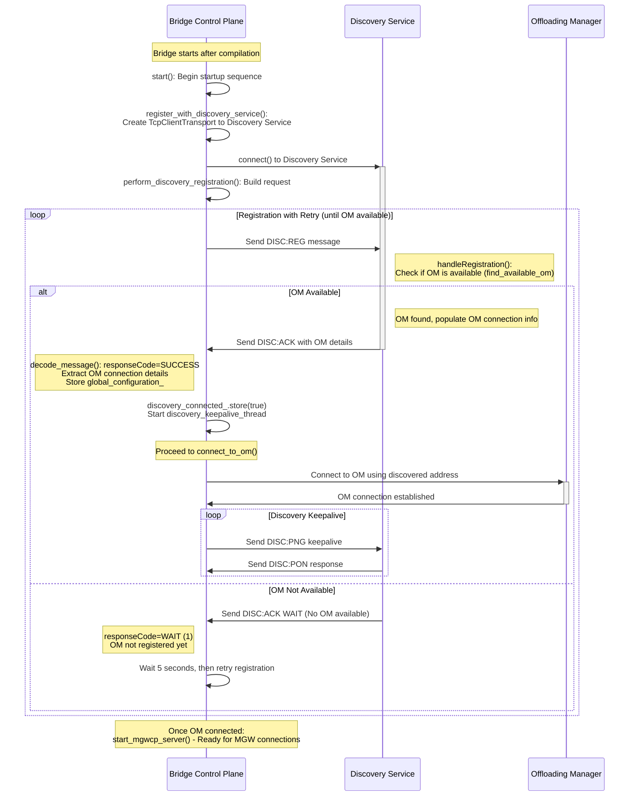
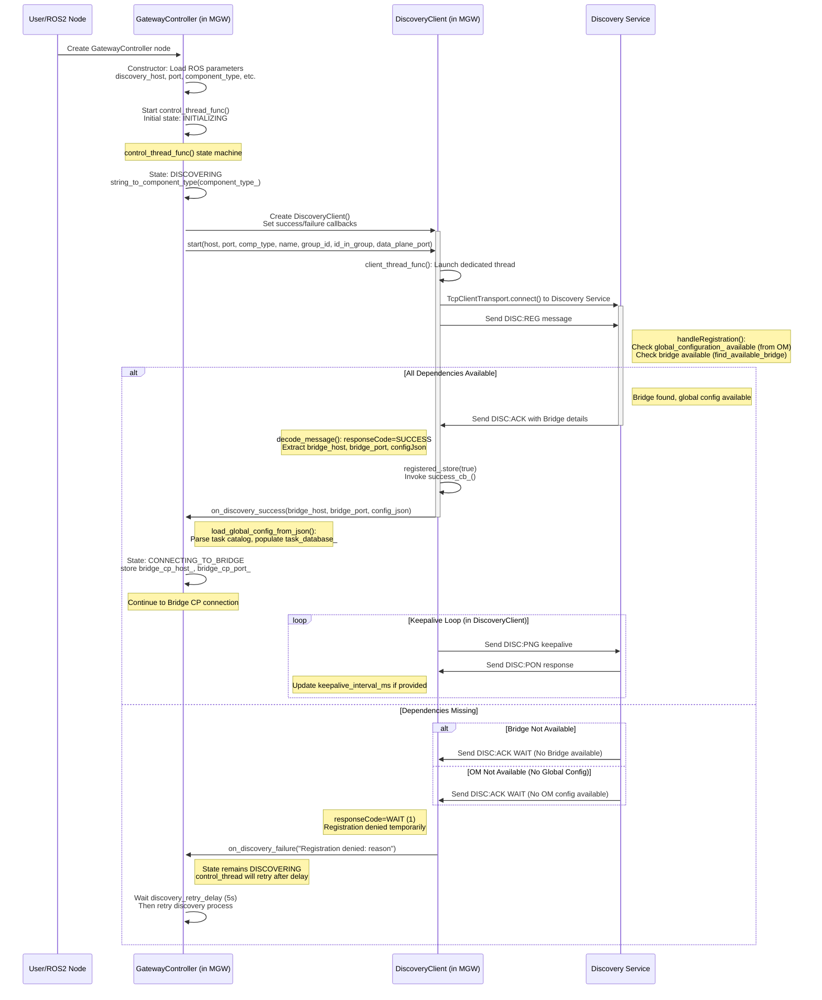
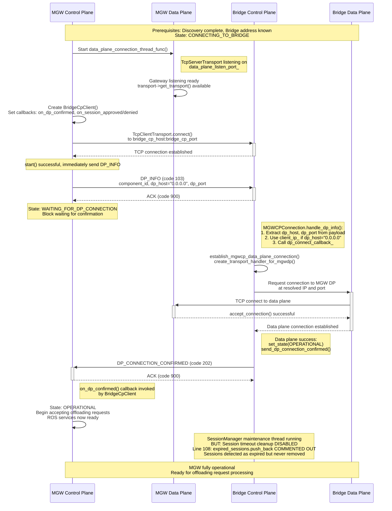
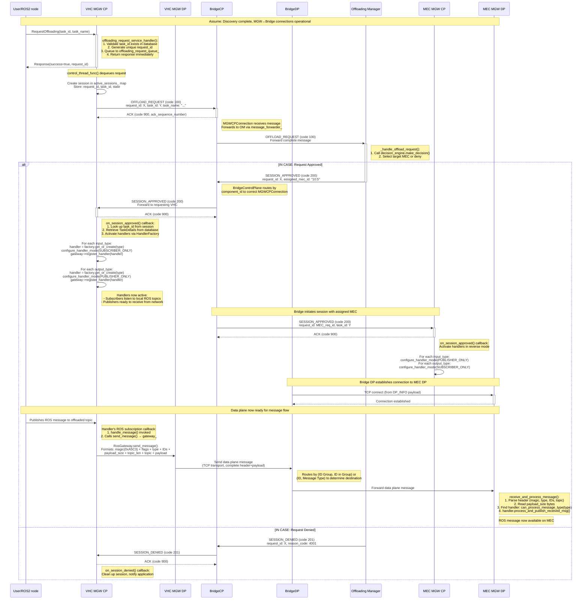

**TO RENDER THE DIAGRAMS, USE A MARKDOWN VIEWER THAT SUPPORTS MERMAID SYNTAX, SUCH AS VS CODE WITH THE "Markdown Preview Mermaid Support" EXTENSION.**

## 1. OM Discovery Process

## 2. Bridge Discovery Process

## 3. VHC/MEC MGW Discovery Process

## 4. MGW Startup Procedure (After Discovery)

## 5. High Level Offloading Request Flow

