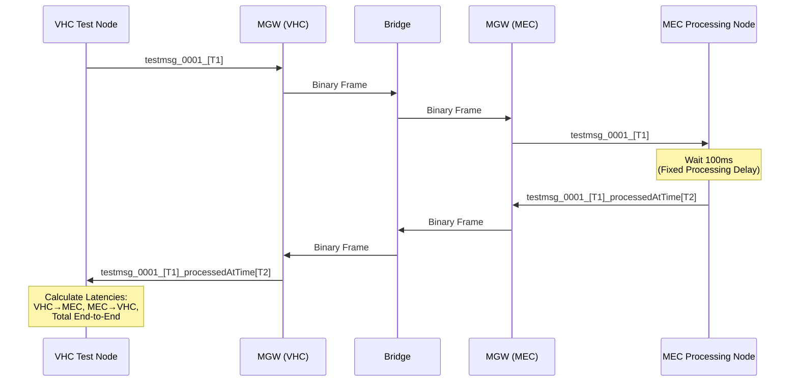

# Offloading Latency Test Loopback - User Guide

## 0. NAMING CONVENTION
Core terms used in the test application:
* **VHC Test Node** – Vehicle-side test application that generates test messages and measures end-to-end latency
* **MEC Processing Node** – Edge-side test application that receives messages, applies fixed processing delay, and returns results
* **test_input_topic** – ROS2 topic for VHC→MEC test messages (MessageType: STRING_TEST_INPUT = 201)
* **test_result_topic** – ROS2 topic for MEC→VHC result messages (MessageType: STRING_TEST_RESULT = 202)
* **STRING_TEST_PIPELINE** – Task ID 3 in global configuration, defines the loopback test workflow
* **fixed processing delay** – Simulated MEC computation time (default: 100ms)
* **end-to-end latency** – Total round-trip time from VHC message publish to result reception

---

## 1. INTRODUCTION & SCOPE
This user guide covers the `offloading_latency_test_loopback` ROS2 package, a Python-based testing application designed to measure and validate the performance of the VHC-MEC offloading system. The package provides a simple loopback test where the VHC sends numbered test messages to the MEC, which processes them with a configurable delay and returns timestamped results.

Test application responsibilities:
* Generate periodic test messages with embedded timestamps
* Request offloading of STRING_TEST_PIPELINE task from MGW
* Simulate realistic MEC processing with fixed delay
* Measure and report latency metrics (VHC→MEC, MEC→VHC, total end-to-end)
* Provide observable test traffic for system validation

This package does NOT implement actual offloading logic (handled by MGW), route messages (handled by Bridge), or make offloading decisions (handled by OM). It serves purely as a test workload generator and measurement tool.

---

## 2. HIGH-LEVEL ARCHITECTURE

### 2.1 Component Overview
The test package consists of two ROS2 nodes that work together:

**VHC Test Node (`vhc_node.py`):**
1. Publishes periodic test messages to `test_input_topic`
2. Requests offloading via MGW's `request_offloading` service (task_id: "3")
3. Subscribes to `test_result_topic` for processed results
4. Calculates and logs latency metrics for each message

**MEC Processing Node (`mec_processing_node.py`):**
1. Subscribes to `test_input_topic` for incoming test messages
2. Simulates processing with fixed 100ms delay (configurable)
3. Appends processing timestamp to message
4. Publishes result to `test_result_topic`

### 2.2 Message Flow


### 2.3 Test Message Format
**Outgoing (VHC→MEC):**
```
testmsg_0001_[1234567890123456789]
```
- `testmsg`: Message identifier
- `0001`: Message counter (zero-padded to 4 digits by default)
- `[timestamp]`: VHC send timestamp in nanoseconds

**Return (MEC→VHC):**
```
testmsg_0001_[1234567890123456789]_processedAtTime[1234567890223456789]
```
- Original message preserved
- `_processedAtTime[timestamp]`: MEC processing completion timestamp in nanoseconds

### 2.4 Launch Configuration
Both VHC and MEC use dedicated launch files that configure:
* MGW gateway controller (VHC or MEC mode)
* Test node parameters
* Discovery Service connection details
* Component IDs (VHC: `60:5`, MEC: `70:1` by default)
* Data plane ports (VHC: 7401, MEC: 7501 by default)

---

## 3. BUILD & INSTALLATION

### 3.1 Prerequisites
* ROS2 Jazzy environment
* `modular_gateway_sender` package (MGW)
* `std_msgs` package
* Python 3.8+

### 3.2 Build Instructions
The package is built as part of the ROS2 workspace:

```bash
cd /home/ubuntu/ros/src/ros_ws
colcon build --packages-select offloading_latency_test_loopback
source install/setup.bash
```

### 3.3 Package Structure
```
offloading_latency_test_loopback/
├── offloading_latency_test_loopback/
│   ├── __init__.py
│   ├── vhc_node.py              # VHC test application
│   └── mec_processing_node.py   # MEC test application
├── launch/
│   ├── vch_launch.py            # VHC + MGW launch file
│   └── mec_launch.py            # MEC + MGW launch file
├── docs/
│   └── user_guide_TEST.md       # This document
├── package.xml
└── setup.py
```

Files: [ros/src/ros_ws/src/offloading_latency_test_loopback/offloading_latency_test_loopback/vhc_node.py](./ros/src/ros_ws/src/offloading_latency_test_loopback/offloading_latency_test_loopback/vhc_node.py), [ros/src/ros_ws/src/offloading_latency_test_loopback/offloading_latency_test_loopback/mec_processing_node.py](./ros/src/ros_ws/src/offloading_latency_test_loopback/offloading_latency_test_loopback/mec_processing_node.py), [ros/src/ros_ws/src/offloading_latency_test_loopback/launch/vch_launch.py](./ros/src/ros_ws/src/offloading_latency_test_loopback/launch/vch_launch.py), [ros/src/ros_ws/src/offloading_latency_test_loopback/launch/mec_launch.py](./ros/src/ros_ws/src/offloading_latency_test_loopback/launch/mec_launch.py)

---

## 4. CONFIGURATION & PARAMETERS

### 4.1 VHC Test Node Parameters
Declared in `vhc_node.py`:

| Parameter | Type | Default | Description |
|-----------|------|---------|-------------|
| `publish_topic` | string | `test_input_topic` | Topic for outgoing test messages |
| `subscribe_topic` | string | `test_result_topic` | Topic for receiving results |
| `publish_interval_sec` | double | `10.0` | Interval between test messages (seconds) |
| `message_counter_max` | int | `9999` | Maximum counter value before reset |

**Task Configuration:**
* Task ID: `"3"` (STRING_TEST_PIPELINE)
* Offloading requested once after 10-second startup delay
* Uses MGW service `request_offloading`

### 4.2 MEC Processing Node Parameters
Declared in `mec_processing_node.py`:

| Parameter | Type | Default | Description |
|-----------|------|---------|-------------|
| `subscribe_topic` | string | `test_input_topic` | Topic for incoming test messages |
| `publish_topic` | string | `test_result_topic` | Topic for publishing results |
| `fixed_processing_delay_ms` | double | `100.0` | **Fixed processing delay in milliseconds** |

**Processing Behavior:**
* Receives message at time `T_recv`
* Calculates intended publish time: `T_publish = T_recv + 100ms`
* Waits until `T_publish` using precise timing loop
* Publishes result immediately
* Logs warning if actual publish deviates >1ms from intended time

**Important Note:** The **100ms fixed processing delay** simulates realistic MEC computation time. This delay is applied to EVERY message to provide consistent, measurable latency characteristics for system validation. The delay can be modified via the `fixed_processing_delay_ms` parameter if different processing times need to be tested.

### 4.3 Launch File Parameters
**VHC Launch (`vch_launch.py`):**

| Argument | Default | Description |
|----------|---------|-------------|
| `discovery_host` | `192.168.50.114` | Discovery Service IP address |
| `discovery_port` | `9090` | Discovery Service port |
| `component_name` | `vhc_test_gateway` | VHC component name |
| `group_id` | `60` | VHC group ID |
| `id_in_group` | `5` | VHC ID within group |
| `listen_port` | `7401` | VHC data plane listen port |

**MEC Launch (`mec_launch.py`):**

| Argument | Default | Description |
|----------|---------|-------------|
| `discovery_host` | `192.168.50.114` | Discovery Service IP address |
| `discovery_port` | `9090` | Discovery Service port |
| `component_name` | `mec_test_gateway` | MEC component name |
| `group_id` | `70` | MEC group ID |
| `id_in_group` | `1` | MEC ID within group |
| `listen_port` | `7501` | MEC data plane listen port |

**Topic Overrides:**
Both launch files override MGW handler topics to align with test application:
```python
'string_test_input_handler.topic': 'test_input_topic',
'string_test_result_handler.topic': 'test_result_topic'
```

---

## 5. RUNNING THE TEST APPLICATION

### 5.1 Prerequisites
Ensure the following components are running in order:
1. Discovery Service
2. Offloading Manager
3. Bridge
4. VHC components (MGW + VHC Test Node)
5. MEC components (MGW + MEC Processing Node)

### 5.2 Starting VHC Side
**Using launch file:**
```bash
cd /home/ubuntu/ros/src/ros_ws
source install/setup.bash
ros2 launch offloading_latency_test_loopback vch_launch.py
```

**With custom parameters:**
```bash
ros2 launch offloading_latency_test_loopback vch_launch.py \
  discovery_host:=192.168.1.100 \
  group_id:=60 \
  id_in_group:=10
```

**Manual startup (for debugging):**
```bash
# Terminal 1: MGW Gateway Controller
ros2 run modular_gateway_sender gateway_controller \
  --ros-args \
  -p discovery_service.host:=192.168.50.114 \
  -p identity.component_type:=V \
  -p identity.group_id:=60 \
  -p identity.id_in_group:=5

# Terminal 2: VHC Test Node
ros2 run offloading_latency_test_loopback vhc_node
```

### 5.3 Starting MEC Side
**Using launch file:**
```bash
cd /home/ubuntu/ros/src/ros_ws
source install/setup.bash
ros2 launch offloading_latency_test_loopback mec_launch.py
```

**With custom processing delay:**
```bash
ros2 run offloading_latency_test_loopback mec_processing_node \
  --ros-args \
  -p fixed_processing_delay_ms:=200.0
```

### 5.4 Expected Startup Sequence
**VHC side logs:**
```
[INFO] [vhc_node]: VHC Node started. Publishing to 'test_input_topic', subscribing to 'test_result_topic'.
[INFO] [gateway_controller]: GatewayController transitioning to DISCOVERING
[INFO] [gateway_controller]: Successfully registered with Discovery Service
[INFO] [gateway_controller]: State transition: OPERATIONAL
[INFO] [vhc_node]: VHC: Requesting offloading for task: 3
[INFO] [vhc_node]: VHC: Offloading request successful! Request ID: 12345
[INFO] [vhc_node]: VHC: Published: "testmsg_0001_[1234567890123456789]"
```

**MEC side logs:**
```
[INFO] [mec_processing_node]: MEC Processing Node started. Subscribing to 'test_input_topic', publishing to 'test_result_topic'. Fixed processing delay: 100.0 ms.
[INFO] [mec_gateway]: GatewayController transitioning to DISCOVERING
[INFO] [mec_gateway]: Successfully registered with Discovery Service
[INFO] [mec_gateway]: State transition: OPERATIONAL
[INFO] [mec_processing_node]: MEC: Published: "testmsg_0001_[...]_processedAtTime[...]"
```

---

## 6. INTERPRETING RESULTS

### 6.1 Latency Report Format
The VHC Test Node logs detailed latency metrics for each received result:

```
--- Latency Report for testmsg_0001 ---
  VHC Send Time (ns):         1234567890123456789
  MEC Process Time (ns):      1234567890223456789
  VHC Receive Time (ns):      1234567890323456789
  ---------------------------------------
  VHC Send -> MEC Process:    100.000 ms
  MEC Process -> VHC Receive: 100.000 ms
  Total End-to-End Delay:     200.000 ms
---------------------------------------
```

### 6.2 Latency Components
**VHC Send → MEC Process:**
* Time from VHC message publish to MEC processing completion
* Includes: VHC MGW serialization + network transmission + Bridge routing + MEC MGW deserialization + **100ms fixed processing delay**

**MEC Process → VHC Receive:**
* Time from MEC result publish to VHC reception
* Includes: MEC MGW serialization + network transmission + Bridge routing + VHC MGW deserialization

**Total End-to-End Delay:**
* Complete round-trip time from VHC publish to result reception
* **Minimum theoretical**: 100ms (fixed processing delay alone)


---

## 7. ADVANCED USAGE

### 7.1 Modifying Test Parameters
**Change message frequency:**
```bash
ros2 run offloading_latency_test_loopback vhc_node \
  --ros-args \
  -p publish_interval_sec:=5.0  # Send every 5 seconds
```

**Increase message counter range:**
```bash
ros2 run offloading_latency_test_loopback vhc_node \
  --ros-args \
  -p message_counter_max:=99999  # 5-digit counter
```

**Simulate heavier MEC processing:**
```bash
ros2 run offloading_latency_test_loopback mec_processing_node \
  --ros-args \
  -p fixed_processing_delay_ms:=500.0  # 500ms processing time
```

### 7.2 Multiple VHC/MEC Pairs
To test load balancing or concurrent sessions:

**VHC Instance 1:**
```bash
ros2 launch offloading_latency_test_loopback vch_launch.py \
  group_id:=60 id_in_group:=1 listen_port:=7401
```

**VHC Instance 2:**
```bash
ros2 launch offloading_latency_test_loopback vch_launch.py \
  group_id:=60 id_in_group:=2 listen_port:=7402
```

**MEC Instance 1:**
```bash
ros2 launch offloading_latency_test_loopback mec_launch.py \
  group_id:=70 id_in_group:=1 listen_port:=7501
```

**Important:** Each instance MUST have unique `id_in_group` and `listen_port`.

### 7.3 Logging and Debugging
**Enable debug logging:**
```bash
ros2 run offloading_latency_test_loopback mec_processing_node \
  --ros-args --log-level debug
```

**View ROS2 topic traffic:**
```bash
# Monitor test messages
ros2 topic echo /test_input_topic

# Monitor results
ros2 topic echo /test_result_topic

# Check message rate
ros2 topic hz /test_input_topic
```

**Check MGW service availability:**
```bash
ros2 service list | grep request_offloading
ros2 service type /request_offloading
```

### 7.4 Automated Testing Scripts
**Continuous latency monitoring:**
```bash
#!/bin/bash
# Run test for 1 hour and log results
timeout 3600 ros2 launch offloading_latency_test_loopback vch_launch.py 2>&1 | \
  grep "Total End-to-End Delay" | \
  tee latency_results_$(date +%Y%m%d_%H%M%S).log
```

**Extract latency statistics:**
```bash
# Parse VHC logs for latency values
grep "Total End-to-End Delay" vhc.log | \
  awk '{print $NF}' | sed 's/ms//' | \
  awk '{sum+=$1; sumsq+=$1*$1; count++} END {
    print "Mean:", sum/count, "ms"
    print "StdDev:", sqrt(sumsq/count - (sum/count)^2), "ms"
  }'
```

---

## 8. TROUBLESHOOTING GUIDE

### 8.1 Startup Issues

**VHC Node fails to start:**
```
[ERROR] [vhc_node]: MGW offloading service not available after 5 seconds
```
- **Cause**: MGW gateway_controller not running or not operational
- **Solution**: Ensure `gateway_controller` launched before `vhc_node`
- **Check**: `ros2 service list` should show `/request_offloading`

**Offloading request failed:**
```
[ERROR] [vhc_node]: Offloading request failed: No Bridge available
```
- **Cause**: System not fully initialized or Bridge not registered
- **Solution**: Wait for Discovery Service, OM, and Bridge to be operational
- **Check**: Bridge logs should show "OPERATIONAL" state

**MEC not receiving messages:**
- **Cause**: Session not approved or data plane not connected
- **Solution**: Check OM logs for SESSION_APPROVED, Bridge logs for DP_CONNECTION_CONFIRMED
- **Check**: Bridge routing table should have entries for `60:5→70:1`


---

## 9. INTEGRATION WITH GLOBAL CONFIGURATION

### 9.1 Task Definition in config.json
The test application requires task ID 3 in the OM's global configuration:

```json
{
  "available_tasks": [
    {
      "task_id": 3,
      "task_name": "STRING_TEST_PIPELINE",
      "input_message_types": [201],
      "output_message_types": [202]
    }
  ]
}
```

See [OffloadingManager/config.json](../../../../OffloadingManager/config.json)

**Message Type Definitions:**
* `201` - STRING_TEST_INPUT: VHC→MEC test messages
* `202` - STRING_TEST_RESULT: MEC→VHC result messages

These are defined in MGW's `message_header.hpp` enum.

### 9.2 Handler Registration
MGW automatically creates handlers for task 3 when session is approved:

**VHC Side (after SESSION_APPROVED):**
* `StringTestInputHandler`: SUBSCRIBE mode, publishes to data plane (MessageType 201)
* `StringTestResultHandler`: PUBLISH mode, receives from data plane (MessageType 202)

**MEC Side (after SESSION_APPROVED):**
* `StringTestInputHandler`: PUBLISH mode, receives from data plane (MessageType 201)
* `StringTestResultHandler`: SUBSCRIBE mode, publishes to data plane (MessageType 202)

### 9.3 Modifying for Custom Message Types
To test with custom ROS2 message types:

1. **Define new MessageType enum** in MGW `message_header.hpp`
2. **Create custom handlers** in MGW (derive from `MessageHandlerBase`)
3. **Update global config** with new task definition and message type IDs
4. **Modify test nodes** to use custom message type
5. **Rebuild** both MGW and test package

---

